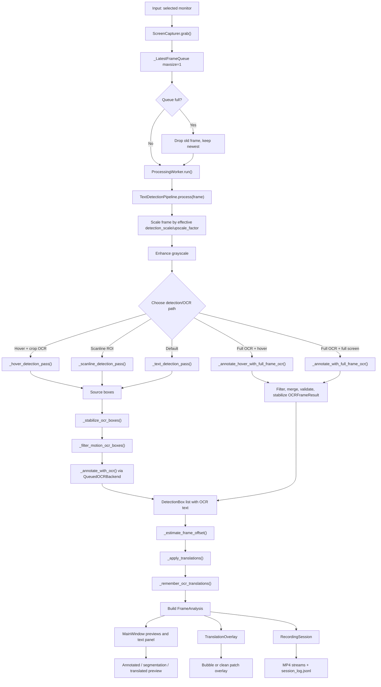
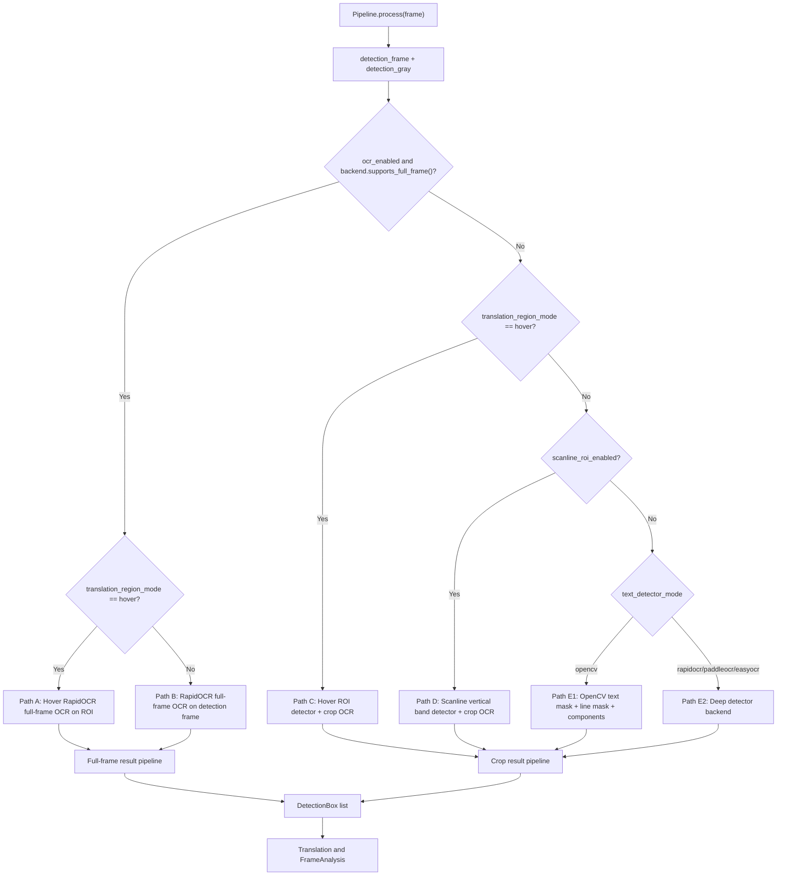
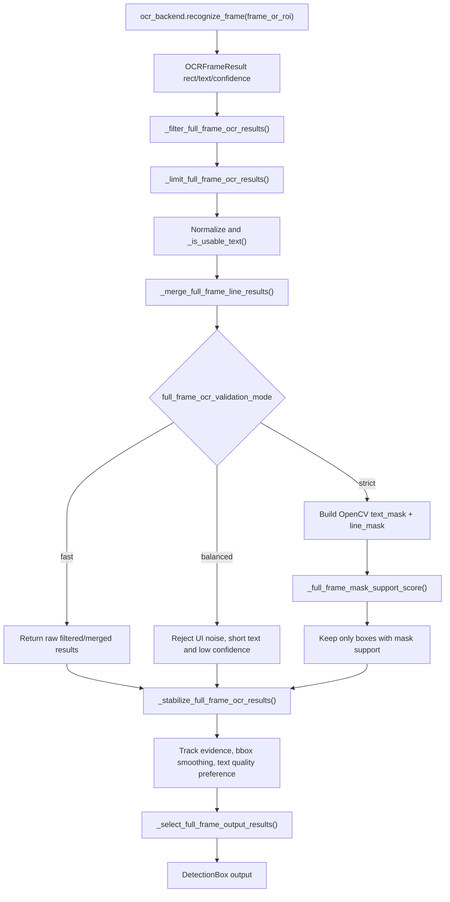
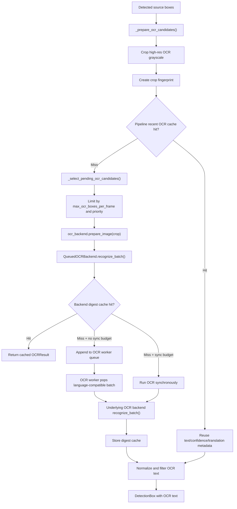
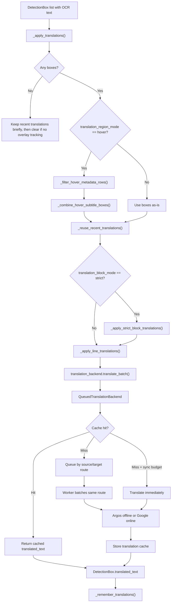
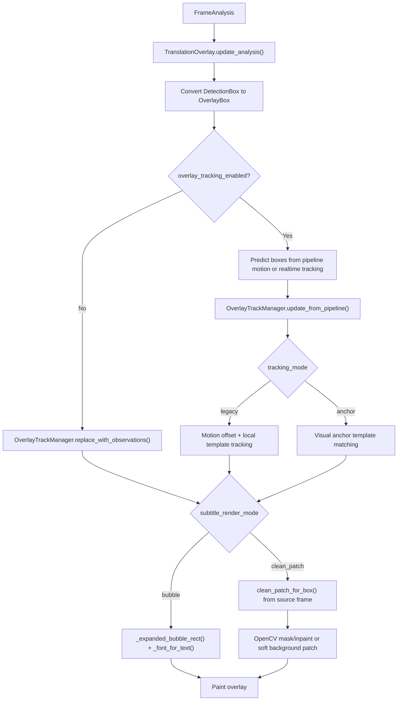
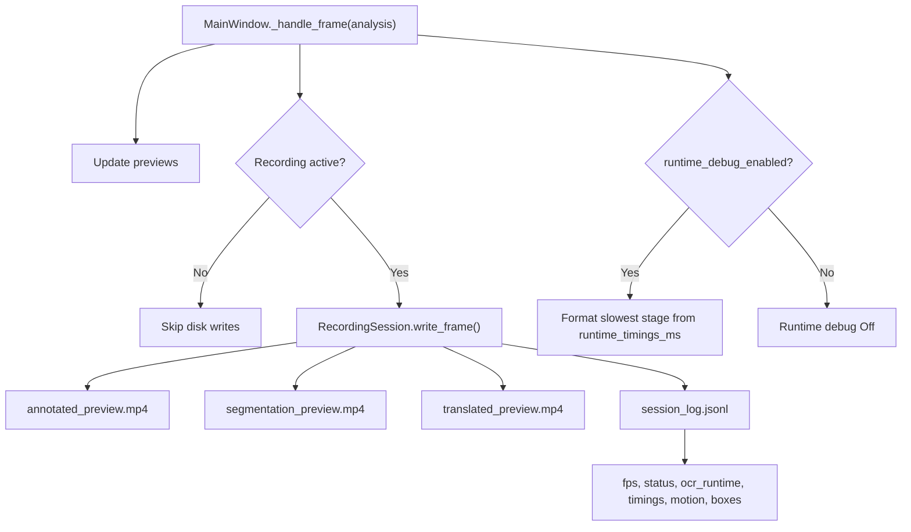
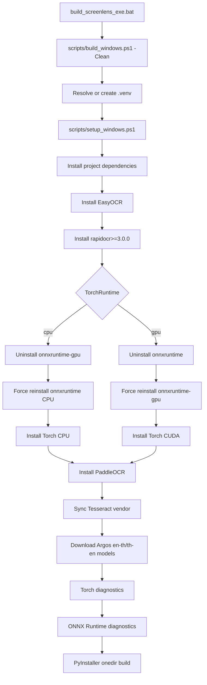

# ScreenLens Pipeline Mermaid Diagrams

เอกสารนี้สรุป pipeline ปัจจุบันของ ScreenLens-Detection จากโค้ดบน branch `feature-optimization-efficency-4` ที่ HEAD `5f1cf9c` พร้อม diagram สำหรับใช้ benchmark FPS/latency และอธิบาย path สำคัญของ OCR, translation, overlay, recording และ build/runtime provider

## Git Reference

| Label | Branch / ref | Commit | ใช้เทียบอะไร |
| --- | --- | --- | --- |
| Current feature-4 | `feature-optimization-efficency-4` | `5f1cf9c` | setup/build แยก RapidOCR กับ ONNX Runtime provider และตรวจ diagnostics |
| Overlay bubble tuning | `feature-optimization-efficency-4` | `175fbd2`, `2650e9a` | compact/expanded bubble และ font fitting ใน overlay |
| Full-frame validation | `feature-optimization-efficency-4` | `3e2dc96` | validation mode `fast` / `balanced` / `strict` |
| Full-frame output stability | `feature-optimization-efficency-4` | `e0ec945` | output limit และ stability สำหรับ RapidOCR full-frame OCR |
| Main optimized merge | `origin/main` | `852565d` | merge optimization ชุดก่อนหน้าเข้า main |
| Feature 3 baseline | `origin/feature-optimization-efficiency3` | `35737c7` | hover/full-frame OCR และ subtitle block logic ก่อน feature-4 |
| V2.1 base | `ver2.1` | `ebbe24a` | จุดก่อน full-frame OCR tuning ชุดใหญ่ |
| V2.0 base | `ver2.0` | `fc03faa` | จุดก่อน queued OCR / scanline / hover optimization |

ตัวอย่าง checkout สำหรับ benchmark:

```powershell
git checkout 5f1cf9c
git checkout 3e2dc96
git checkout e0ec945
git checkout 852565d
git checkout fc03faa
```

## 1. Runtime Pipeline ปัจจุบัน

ไฟล์หลัก:

- `src/screenlens_detection/worker.py`
- `src/screenlens_detection/pipeline.py`
- `src/screenlens_detection/ocr.py`
- `src/screenlens_detection/translation.py`
- `src/screenlens_detection/overlay.py`
- `src/screenlens_detection/recording.py`



Output หลักคือ `FrameAnalysis` ซึ่งมี `boxes`, `source_frame`, `annotated_frame`, `processed_preview`, `translated_preview`, `fps`, `ocr_runtime`, `content_offset_*` และ `runtime_timings_ms`

## 2. Detection Decision Tree



Benchmark hint:

- Path A/B วัด RapidOCR full-frame OCR และ validation mode
- Path C วัด hover ROI ที่ลดพื้นที่ detector/OCR
- Path D วัด scanline ROI ที่แบ่งงาน detector ข้ามหลาย frame
- Path E1/E2 วัด OpenCV detector เทียบ deep detector

## 3. Full-frame OCR Validation

ใช้เมื่อ OCR backend เป็น `RapidOCRFullBackend` หรือ backend อื่นที่ `supports_full_frame()` เป็น `True`



Mode summary:

- `fast`: เหมาะกับวัด raw recall/latency เพราะไม่ใช้ validation หนัก
- `balanced`: default, ลด false positive จาก UI noise โดยไม่สร้าง mask เพิ่ม
- `strict`: เพิ่ม OpenCV validation mask เหมาะกับลด OCR หลุดจากภาพที่มี UI noise เยอะ

## 4. Crop OCR Queue และ Cache



Crop OCR path ใช้กับ EasyOCR/Tesseract และ deep detector ที่คืนเฉพาะ boxes ส่วน RapidOCR full-frame OCR จะข้าม path นี้

## 5. Translation Pipeline



Strict block mode รวมกล่องที่ดูเป็น paragraph/subtitle หลายบรรทัดเป็น block เดียวก่อนแปล แล้วข้าม line translation ซ้ำของ member lines

## 6. Overlay, Clean Patch และ Tracking



เมื่อเปิด visual tracking, `OverlayTrackingWorker` จะ capture grayscale frame ที่ลด resolution แล้วส่ง `TrackingFrame` ให้ overlay เพื่อ track กล่องระหว่าง frame หลัก

## 7. Recording และ Runtime Debug



Fields ที่ควรดูใน log:

- `fps`
- `runtime_timings_ms.total`
- `runtime_timings_ms.scale_frame`
- `runtime_timings_ms.opencv_detection` หรือ `runtime_timings_ms.deep_detection`
- `runtime_timings_ms.hover_detection`
- `runtime_timings_ms.scanline_detection`
- `runtime_timings_ms.ocr_annotation`
- `runtime_timings_ms.full_frame_ocr`
- `runtime_timings_ms.hover_full_frame_ocr`
- `runtime_timings_ms.translation`
- `detected_boxes`
- `content_motion_confidence`

## 8. Build / Setup Provider Flow



จุดสำคัญของ `5f1cf9c`: RapidOCR ถูกติดตั้งก่อน แล้วจึง force reinstall ONNX Runtime provider ที่เลือก เพื่อกัน dependency resolver ดึง provider ผิดตัวกลับมา

## 9. Optimization Evolution Timeline

```mermaid
flowchart TD
    A["4282d9e<br/>OCR + translation + overlay support"] --> B["2c9dc68<br/>recent translation reuse"]
    B --> C["3e3ac1e<br/>selectable text detectors"]
    C --> D["fc03faa<br/>tag ver2.0"]

    D --> E["2351918<br/>queued OCR + OCR cache"]
    E --> F["590419e<br/>RapidOCR detector + queued translation"]
    F --> G["846290e<br/>OCR workers + Tesseract batch"]
    G --> H["95e538a<br/>detection scale + motion cache"]
    H --> I["637325f<br/>scanline ROI"]
    I --> J["a2c4935<br/>hover ROI"]
    J --> K["ebbe24a<br/>tag ver2.1"]

    K --> L["28b5202<br/>full-frame OCR tracking"]
    L --> M["db63a8a<br/>hover full-frame OCR"]
    M --> N["6768a53<br/>multiline subtitle filtering"]
    N --> O["35737c7<br/>longer blocks + wider ROI"]
    O --> P["852565d<br/>main optimized merge"]
    P --> Q["889f7c<br/>drop old capture frames"]
    Q --> R["e0ec945<br/>full-frame output stability"]
    R --> S["3e2dc96<br/>full-frame validation modes"]
    S --> T["175fbd2<br/>compact overlay bubble"]
    T --> U["2650e9a<br/>bubble expansion tuning"]
    U --> V["5f1cf9c<br/>RapidOCR/ONNX setup flow"]
```



## 10. Suggested Benchmark Matrix

| Benchmark | Checkout commit | Focus |
| --- | --- | --- |
| Baseline V2.0 | `fc03faa` | ก่อน queue/cache/scanline/hover |
| Async OCR V1 | `2351918` | queued OCR + OCR cache |
| RapidOCR + translation backend | `590419e` | RapidOCR detector, Argos/Google queued translation |
| OCR workers | `846290e` | batch + worker count |
| Detection scale/cache | `95e538a` | FPS เมื่อปรับ detection scale |
| Scanline ROI | `637325f` | vertical band slicing |
| Hover ROI | `a2c4935` | OCR เฉพาะ cursor region |
| Full-frame OCR | `28b5202` | RapidOCR full-frame det+rec |
| Hover full-frame OCR | `db63a8a` | ROI + full-frame backend |
| Feature 3 optimized | `35737c7` | subtitle/hover block logic |
| Main optimized merge | `852565d` | หลัง merge เข้า main |
| Full-frame stability | `e0ec945` | output limit/stability |
| Validation modes | `3e2dc96` | `fast` vs `balanced` vs `strict` |
| Overlay compact bubble | `175fbd2` | compact text bubble behavior |
| Overlay expanded bubble | `2650e9a` | long translated text fitting |
| Current setup/build | `5f1cf9c` | ONNX Runtime CPU/GPU provider install flow |

สำหรับ realtime pipeline ควรเทียบ median frame time และ percentile spike คู่กับ average FPS เพราะ OCR/translation queue ทำให้บาง frame เร็วมาก แต่บาง frame spike ตอน backend ทำงานจริง
