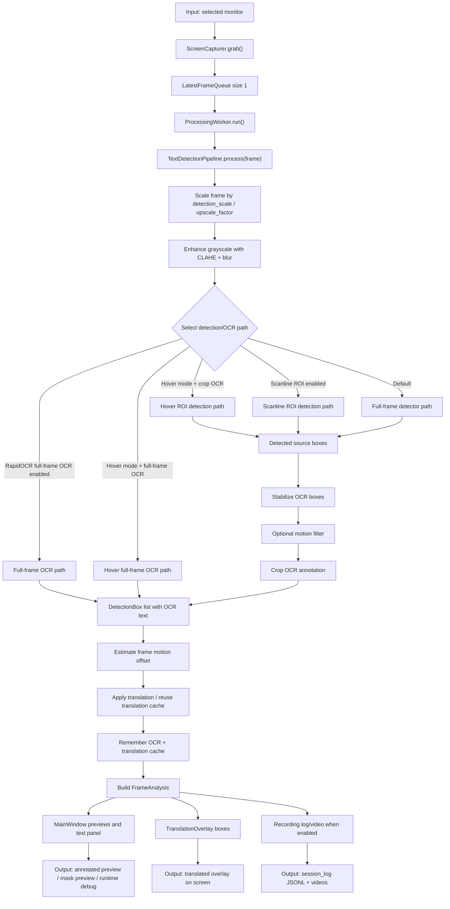
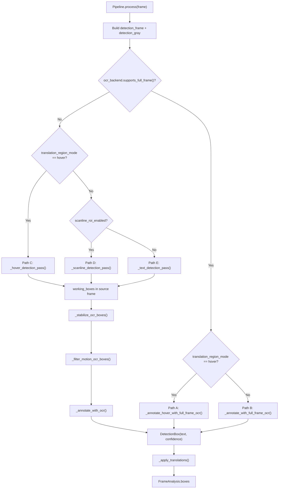
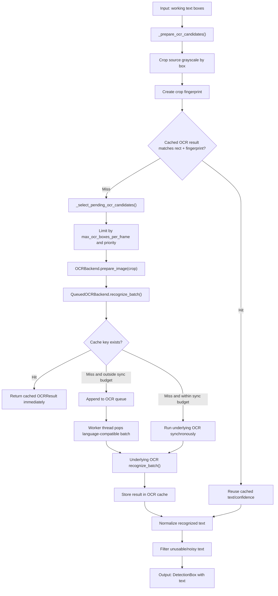
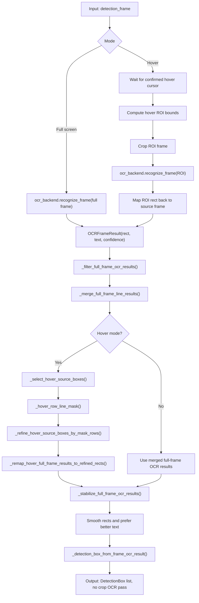
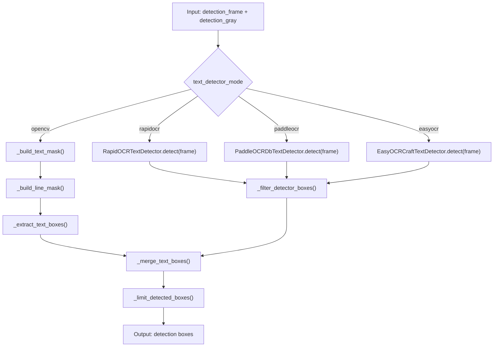
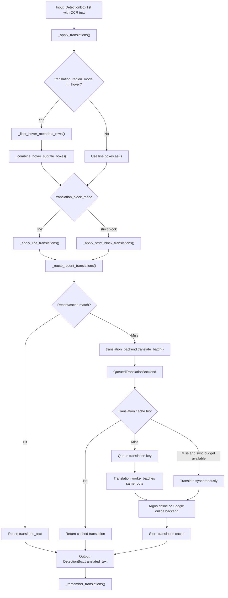

# ScreenLens Pipeline Mermaid Diagrams

เอกสารนี้สรุป pipeline ด้านในของ ScreenLens-Detection สำหรับใช้เทียบก่อน/หลัง optimize และใช้เลือก commit ไป benchmark FPS/latency ได้ตรงจุด

ข้อมูลอ้างอิง git ล่าสุดที่ตรวจจาก repo:

| Label | Branch / ref | Commit | ใช้เทียบอะไร |
| --- | --- | --- | --- |
| Current feature | `origin/feature-optimization-efficiency3` | `35737c77c3dbf6c69c21b6f35a467c6389473d60` | Logic hover/full-frame OCR ล่าสุดบน feature branch |
| Current main | `origin/main` | `852565db13494210c339ae7b86dd011108ea6ce8` | Merge PR #19 จาก `stably-for-dev`; มี optimization ล่าสุดรวมเข้า main แล้ว |
| V2.1 base | `ver2.1` | `ebbe24a` | จุดก่อน feature-optimization-efficiency3 |
| V2.0 base | `ver2.0` | `fc03faa` | จุดก่อน optimization ชุด queued OCR / scanline / hover |

คำสั่ง checkout สำหรับ benchmark:

```powershell
git checkout 35737c77c3dbf6c69c21b6f35a467c6389473d60
git checkout 852565db13494210c339ae7b86dd011108ea6ce8
git checkout ebbe24a
git checkout fc03faa
```

## 1. Runtime Pipeline ปัจจุบัน

ใช้กับ branch/commit:

- `origin/feature-optimization-efficiency3` at `35737c77c3dbf6c69c21b6f35a467c6389473d60`
- `origin/main` at `852565db13494210c339ae7b86dd011108ea6ce8`

ไฟล์หลัก:

- `src/screenlens_detection/worker.py`
- `src/screenlens_detection/pipeline.py`
- `src/screenlens_detection/ocr.py`
- `src/screenlens_detection/translation.py`
- `src/screenlens_detection/overlay.py`



Input หลักคือ frame จาก monitor ที่เลือก ส่วน output คือ `FrameAnalysis` ที่มี `boxes`, preview frames, FPS, runtime timings, OCR status, motion offset และข้อมูลที่ overlay/recording ใช้ต่อ

## 2. Current Detection Decision Tree

ใช้กับ branch/commit:

- `origin/feature-optimization-efficiency3` at `35737c77c3dbf6c69c21b6f35a467c6389473d60`

จุดประสงค์: ใช้ดูว่า test run แต่ละรอบกำลังเข้า path ไหน เพราะ FPS ต่างกันมากตาม path



Benchmark hint:

- Path A/B วัดผล RapidOCR full-frame OCR
- Path C วัดผล hover ROI ที่ลดพื้นที่ detect/OCR
- Path D วัดผล scanline ROI ที่แบ่ง frame เป็น bands
- Path E วัดผล default full-screen detector + crop OCR

## 3. Crop OCR Queue และ Cache

เริ่มมีใน:

- `origin/feature-optimization-efficiency` at `2351918514534be0d0e1b46339996e26d0435e66`

ปรับแรงขึ้นใน:

- `origin/feature-optimization-efficiency2` at `846290e7d22f8b92a9f5d1f483645be8ffb32d5c`
- `origin/feature-optimization-efficiency2` at `95e538a67114f8843b58d5cc537f0c0528fab52e`

ยังอยู่ใน current:

- `origin/feature-optimization-efficiency3` at `35737c77c3dbf6c69c21b6f35a467c6389473d60`



Performance idea:

- commit `2351918` เหมาะใช้เทียบก่อน/หลัง async queue
- commit `846290e` เหมาะใช้เทียบผล `SCREENLENS_OCR_WORKERS`
- commit `95e538a` เหมาะใช้เทียบผล detection scale + OCR cache reuse

## 4. Full-frame OCR และ Hover Full-frame OCR

เริ่ม full-frame tracking/merge ใน:

- `origin/feature-optimization-efficiency3` at `28b5202ee4b80dd09e983258859e14e45801dd00`

เพิ่ม hover full-frame OCR ใน:

- `origin/feature-optimization-efficiency3` at `db63a8a8bf1ad756706df2eca60a212966ebb14d`

เพิ่ม multiline subtitle filtering/merge ใน:

- `origin/feature-optimization-efficiency3` at `6768a5310dde03011f77ea1fda4489f5df87432f`
- `origin/feature-optimization-efficiency3` at `35737c77c3dbf6c69c21b6f35a467c6389473d60`



Performance idea:

- ถ้าเลือก `RapidOCR full OCR` จะเข้าทางนี้และไม่ต้อง crop OCR ทีละกล่อง
- เหมาะกับ benchmark ว่า full-frame OCR เร็วกว่า crop OCR หรือไม่ในวิดีโอเดียวกัน
- Hover full-frame OCR ลดพื้นที่ input แต่ยังใช้ full-frame OCR backend ใน ROI

## 5. Text Detector Modes

เริ่ม selectable detector ใน:

- `origin/feature-change-language-onscreen` at `3e3ac1e34b6f9b64ae6dec196160a037fd5be805`

เพิ่ม RapidOCR DBNet detector ใน:

- `origin/feature-optimization-efficiency` at `590419ee41a0e2c8f46ca69ad0131f5f920efcab`

ยังอยู่ใน current:

- `origin/feature-optimization-efficiency3` at `35737c77c3dbf6c69c21b6f35a467c6389473d60`



Performance idea:

- OpenCV path เป็น baseline ที่ dependency เบา
- Deep detector path อาจแม่นขึ้นในบางภาพ แต่มี overhead สูงกว่า
- RapidOCR detector path ขึ้นกับ ONNX Runtime CPU/CUDA

## 6. Translation Queue, Cache และ Reuse

เพิ่ม translation backend/cache ชุดใหญ่ใน:

- `origin/feature-optimization-efficiency` at `590419ee41a0e2c8f46ca69ad0131f5f920efcab`

ยังอยู่ใน current:

- `origin/feature-optimization-efficiency3` at `35737c77c3dbf6c69c21b6f35a467c6389473d60`



Performance idea:

- Argos offline default มี sync budget มากกว่า Google online
- Google online มี request budget, timeout และ retry cooldown
- Recent translation reuse ช่วยมากเมื่อ OCR text/ตำแหน่งใกล้เคียงกันหลาย frame

## 7. Optimization Evolution Timeline

Diagram นี้ใช้เป็นแผนที่เลือก commit สำหรับ benchmark เป็นรุ่น ๆ

```mermaid
flowchart TD
    A["4282d9e<br/>feature-build-screenlens<br/>OCR + translation + overlay support"] --> B["2c9dc68<br/>stably-for-dev<br/>recent translation reuse"]
    B --> C["3e3ac1e<br/>feature-change-language-onscreen<br/>selectable text detectors"]
    C --> D["fc03faa<br/>tag ver2.0<br/>base before optimization set"]

    D --> E["2351918<br/>feature-optimization-efficiency<br/>queued OCR + OCR cache"]
    E --> F["590419e<br/>feature-optimization-efficiency<br/>RapidOCR detector + translation backend"]
    F --> G["846290e<br/>feature-optimization-efficiency2<br/>OCR workers + Tesseract batch"]
    G --> H["95e538a<br/>feature-optimization-efficiency2<br/>detection scale + cache improvements"]
    H --> I["637325f<br/>feature-optimization-efficiency2<br/>scanline ROI"]
    I --> J["a2c4935<br/>feature-optimization-efficiency2<br/>hover target + region modes"]
    J --> K["ebbe24a<br/>tag ver2.1<br/>merged optimization set"]

    K --> L["28b5202<br/>feature-optimization-efficiency3<br/>full-frame OCR tracking + merge"]
    L --> M["db63a8a<br/>feature-optimization-efficiency3<br/>hover full-frame OCR"]
    M --> N["6768a53<br/>feature-optimization-efficiency3<br/>multiline subtitle detection/filter"]
    N --> O["35737c7<br/>feature-optimization-efficiency3<br/>longer text blocks + wider ROI"]
    O --> P["852565d<br/>origin/main<br/>merge PR #19"]
```



## 8. Suggested Benchmark Matrix

ใช้ video/log เดียวกัน แล้ว checkout commit ตามนี้เพื่อเทียบ FPS, median frame time, OCR submitted/reused และจำนวน boxes

| Benchmark | Checkout commit | Focus |
| --- | --- | --- |
| Baseline V2.0 | `fc03faa` | ก่อน queue/cache/scanline/hover |
| Async OCR V1 | `2351918` | วัดผล queued OCR + OCR cache |
| RapidOCR + translation backend | `590419e` | วัด detector/backend ใหม่ |
| OCR workers | `846290e` | วัดผล batch + worker count |
| Detection scale/cache | `95e538a` | วัด FPS เมื่อลด detection scale |
| Scanline ROI | `637325f` | วัด full-screen video/game แบบแบ่ง bands |
| Hover ROI | `a2c4935` | วัด latency เมื่อ OCR เฉพาะจุดที่ hover |
| Full-frame OCR | `28b5202` | วัด RapidOCR full-frame OCR ไม่ผ่าน crop OCR |
| Hover full-frame OCR | `db63a8a` | วัด ROI + full-frame OCR backend |
| Current optimized | `35737c7` | วัด logic ล่าสุดบน feature branch |
| Current main | `852565d` | วัดหลัง merge เข้า main |

## 9. Output Fields ที่ควรเก็บใน session log

ถ้าจะเอาไปเทียบแบบในภาพ ควรดูอย่างน้อย:

- `fps`
- `runtime_timings_ms.total`
- `runtime_timings_ms.scale_frame`
- `runtime_timings_ms.*detection*`
- `runtime_timings_ms.ocr_annotation`
- `runtime_timings_ms.full_frame_ocr`
- `runtime_timings_ms.hover_full_frame_ocr`
- `runtime_timings_ms.translation`
- `boxes.length`
- status text ที่มี `submitted`, `reused`, `read`

ถ้ามี log สองไฟล์จากคนละ commit ให้เทียบด้วย median frame time ก่อน average FPS เพราะ realtime pipeline มี spike จาก OCR/translation queue เป็นช่วง ๆ
