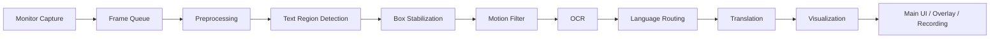

# ScreenLens-Detection: Real-time On-screen Text Detection and OCR

## 1. ภาพรวมโครงการ

`ScreenLens-Detection` เป็นแอปเดสก์ท็อปที่พัฒนาด้วย Python + Qt สำหรับตรวจจับข้อความบนหน้าจอแบบเรียลไทม์ ระบบจะจับภาพจาก monitor ที่ผู้ใช้เลือก ประมวลผลภาพเพื่อตรวจหาบริเวณที่น่าจะเป็นข้อความ ทำ OCR เพื่ออ่านข้อความ และสามารถแปลภาษาไทย/อังกฤษผ่าน backend ที่เลือกได้

เป้าหมายหลักของระบบคือช่วยอ่านข้อความที่ปรากฏบนหน้าจอจากแอปอื่น เกม วิดีโอ เอกสาร หรือหน้าเว็บ แล้วแสดงผลลัพธ์ทั้งในหน้าต่างหลักและแบบ on-screen overlay

## 2. จุดเด่นของระบบ

- จับภาพหน้าจอแบบต่อเนื่องด้วย `mss`
- ตรวจจับบริเวณข้อความด้วย OpenCV, RapidOCR, PaddleOCR หรือ EasyOCR detector
- รองรับข้อความสีเข้มบนพื้นหลังสว่าง และข้อความสีสว่างบนพื้นหลังมืด
- รองรับ OCR ผ่าน EasyOCR, RapidOCR full-frame OCR หรือ Tesseract
- รองรับการแปลภาษาแบบ offline ด้วย Argos Translate และ online ด้วย Google Translate
- มี Qt UI สำหรับ preview ภาพจริง, segmentation mask, translated preview และรายการข้อความ
- มี on-screen overlay สำหรับแสดงผลแปลทับบนหน้าจอ
- มีระบบกัน overlay ถูก capture ซ้ำบน Windows เพื่อลดปัญหาแปลข้อความของตัวเองวนซ้ำ
- บันทึก session เป็นวิดีโอและ log ได้

## 3. ภาพรวม Pipeline



ลำดับการทำงานหลักเริ่มจากการจับภาพหน้าจอ ส่งภาพล่าสุดเข้าสู่ pipeline ประมวลผลภาพเพื่อหากล่องข้อความ อ่านข้อความด้วย OCR แปลภาษา แล้วส่งผลลัพธ์กลับไปแสดงใน UI

## 4. โครงสร้างการทำงานหลัก

```text
ScreenCapturer
  -> ProcessingWorker
    -> TextDetectionPipeline
      -> TextDetectorBackend
      -> OCRBackend
      -> TranslationBackend
    -> FrameAnalysis
  -> MainWindow
  -> TranslationOverlay
  -> RecordingSession
```

### `ScreenCapturer`

อยู่ใน `src/screenlens_detection/capture.py`

หน้าที่คือ enumerate monitor และจับภาพจาก monitor ที่เลือกด้วย `mss` จากนั้นแปลงภาพจาก BGRA เป็น BGR เพื่อให้ใช้งานกับ OpenCV ได้โดยตรง

### `ProcessingWorker`

อยู่ใน `src/screenlens_detection/worker.py`

ทำงานเป็น background thread ด้วย `QThread` เพื่อไม่ให้ UI ค้าง โดยแยก capture loop ออกเป็น thread ย่อย และใช้ queue ขนาด 1 เพื่อเก็บเฉพาะ frame ล่าสุด ถ้าประมวลผลไม่ทันจะ drop frame เก่าแทนการปล่อยให้ queue สะสมจน latency สูง

### `TextDetectionPipeline`

อยู่ใน `src/screenlens_detection/pipeline.py`

เป็นหัวใจหลักของระบบ รับ frame จาก worker แล้วทำ preprocessing, detection, OCR, translation และสร้างผลลัพธ์เป็น `FrameAnalysis`

### `FrameAnalysis`

อยู่ใน `src/screenlens_detection/models.py`

เป็น data object ที่ส่งกลับไปยัง UI มีข้อมูลสำคัญ เช่น annotated frame, segmentation preview, detection boxes, FPS, OCR runtime, monitor label, motion offset และ translated preview

## 5. ขั้นตอนประมวลผลภาพ

### 5.1 Capture Frame

ระบบจับภาพจาก monitor ที่เลือกเป็น frame ต่อเนื่องตาม `capture_interval_ms` ค่า default คือ 40 ms หรือประมาณ 25 FPS โดย worker จะเก็บเฉพาะ frame ล่าสุดเพื่อลด latency เมื่อ OCR/translation ทำงานช้ากว่า capture loop

### 5.2 Scale Frame

ภาพถูกประมวลผลตาม `upscale_factor` ค่า default คือ 1.0 เพื่อคุม latency ในงาน realtime และยังสามารถปรับเพิ่มได้เมื่อต้องอ่านข้อความขนาดเล็ก

### 5.3 Grayscale + CLAHE

ภาพถูกแปลงเป็น grayscale แล้วปรับ local contrast ด้วย CLAHE เพื่อให้ข้อความเด่นขึ้นในสภาพพื้นหลังที่แสงไม่สม่ำเสมอ เช่น UI สีเข้ม, subtitle, หรือข้อความบนภาพ

### 5.4 Dual-polarity Text Mask

ระบบสร้าง mask สองแบบ:

- dark text mask: สำหรับตัวอักษรเข้มบนพื้นหลังสว่าง
- light text mask: สำหรับตัวอักษรสว่างบนพื้นหลังเข้ม

จากนั้นรวม mask ทั้งสองแบบเข้าด้วยกัน และใช้ gradient mask ช่วยลด noise จากพื้นหลังที่ไม่ใช่ข้อความ

### 5.5 Line Mask

ใช้ morphology close/open เพื่อรวม pixel ที่อยู่ใกล้กันให้กลายเป็น candidate line หรือ text region เหมาะกับข้อความที่เป็นคำหรือบรรทัด

### 5.6 Text Box Extraction

ระบบหา connected components จาก line mask แล้วกรอง candidate boxes ด้วยเงื่อนไข เช่น:

- พื้นที่ขั้นต่ำ (`min_contour_area`)
- ความกว้าง/สูงขั้นต่ำ
- ความสูงสูงสุดเทียบกับขนาด frame
- aspect ratio
- foreground ratio และ edge density

หลังจากนั้นมีการ merge กล่องที่ควรอยู่ในบรรทัดเดียวกัน และ suppress กล่องซ้อนกันเพื่อลดผลลัพธ์ซ้ำ

## 6. Text Detector Modes

ระบบรองรับ detector 4 แบบ:

- `Classic OpenCV (Morphology)` เป็นค่า default ใช้ thresholding, morphology และ connected components
- `RapidOCR ONNX DBNet (Optional)` ใช้ detector ONNX จาก RapidOCR พร้อมรองรับ CPU/GPU ผ่าน ONNX Runtime
- `PaddleOCR DBNet (Optional)` ใช้ deep text detector จาก PaddleOCR เมื่อติดตั้ง dependency พร้อม
- `EasyOCR CRAFT (Optional)` ใช้ detector ของ EasyOCR เมื่อติดตั้ง EasyOCR พร้อม

ถ้าเลือก detector ที่ยังไม่ได้ติดตั้ง ระบบจะไม่ crash แต่จะแสดงสถานะว่า backend นั้น unavailable

## 7. OCR Pipeline

ระบบ OCR ถูกออกแบบเป็น backend interface:

- `EasyOCRBackend`
- `RapidOCRFullBackend`
- `TesseractOCRBackend`
- `NoOpOCRBackend`

โดย default จะพยายามใช้ EasyOCR ก่อนถ้ามี จากนั้น fallback ไป Tesseract ถ้าพบ binary หรือ environment ที่ถูกต้อง ผู้ใช้สามารถเลือก `RapidOCR full OCR` เพื่อให้ RapidOCR ตรวจจับและอ่านข้อความทั้ง frame ใน backend เดียวได้ และถ้าไม่มี backend ใดพร้อมใช้งาน แอปยังรันได้ใน detection-only mode

ก่อน OCR ระบบจะเลือกเฉพาะกล่องที่สำคัญตาม priority และจำกัดจำนวนด้วย `max_ocr_boxes_per_frame` เพื่อลดภาระประมวลผล

## 8. Box Stabilization และ Motion Filter

OCR เป็นส่วนที่แพงและไวต่อ noise จึงมีระบบช่วยลดการอ่านผิดหรืออ่านซ้ำ:

- `stable_ocr_frames`: กล่องต้องปรากฏต่อเนื่องอย่างน้อยตามจำนวน frame ที่กำหนดก่อนส่งเข้า OCR
- `stable_box_iou_threshold`: ใช้จับคู่กล่องเดิมกับกล่องใหม่ด้วย IoU
- `motion_filter_enabled`: ถ้าพื้นที่ในกล่องกำลังเปลี่ยนเร็วมาก ระบบสามารถเลี่ยง OCR frame นั้นได้

แนวคิดคืออ่านข้อความเมื่อภาพนิ่งพอ แทนที่จะ OCR ทุกกล่องทุก frame

## 9. Translation Pipeline

ระบบแปลภาษาใช้ backend interface เช่นเดียวกับ OCR:

- `ArgosTranslateBackend`: แปล offline ด้วย Argos Translate เหมาะกับการใช้งานโดยไม่พึ่ง internet
- `GoogleTranslateBackend`: แปล online ด้วย `deep-translator`
- `NoOpTranslationBackend`: ปิดการแปล

ระบบมี cache และ queue เพื่อลดการแปลข้อความซ้ำ โดยเฉพาะเมื่อข้อความเดิมอยู่บนหน้าจอหลาย frame

## 10. Language Routing

ระบบรองรับ source language แบบ auto, English, Thai และ Thai + English ส่วน target language เน้น Thai/English

หลัง OCR ระบบจะ normalize ข้อความ และพยายามตรวจภาษาเบื้องต้นเพื่อเลือก route การแปลที่เหมาะสม ถ้า source และ target เป็นภาษาเดียวกัน ระบบสามารถ reuse ข้อความเดิมแทนการส่งเข้า translation backend

## 11. Visualization

ผลลัพธ์ถูกแสดงหลายรูปแบบ:

- `annotated_frame`: ภาพจริงพร้อมกรอบ detection
- `processed_preview`: segmentation หรือ mask preview
- `translated_preview`: ภาพ preview ที่วาดข้อความแปลลงบนตำแหน่งของกล่อง
- text panel: รายการกล่องพร้อม before/after
- status line: แสดง detector, OCR backend, translation backend, FPS และสถานะ overlay/recording

## 12. On-screen Overlay

`TranslationOverlay` เป็นหน้าต่าง Qt แบบโปร่งใส ไร้กรอบ อยู่บนสุด และไม่รับ focus เพื่อให้ผู้ใช้ยังคลิกใช้งานแอปด้านล่างได้

Overlay ใช้กล่องจาก `FrameAnalysis` แล้ววาดข้อความแปลทับตำแหน่งเดิมบน monitor ที่เลือก โดยมีระบบ tracking ช่วยให้กล่อง overlay ตามเนื้อหาขณะ scroll หรือมี motion ได้ดีขึ้น

บน Windows ระบบเรียก `SetWindowDisplayAffinity` ด้วย `WDA_EXCLUDEFROMCAPTURE` กับ overlay window เพื่อกันไม่ให้ pipeline เห็น overlay ของตัวเองและแปลซ้ำวนไปเรื่อย ๆ

## 13. Recording

`RecordingSession` บันทึกผลลัพธ์เป็น session ในโฟลเดอร์ `recordings/` โดยเก็บ:

- `annotated_preview.mp4`
- `segmentation_preview.mp4`
- `translated_preview.mp4`
- `session_log.jsonl`

log เก็บข้อมูล frame, FPS, monitor, OCR status, จำนวนกล่อง, motion confidence และข้อความที่ detect/translate ได้ เหมาะกับใช้ประกอบ demo หรือส่งหลักฐานผลการทดลอง

## 14. โครงสร้างไฟล์สำคัญ

```text
src/screenlens_detection/
  capture.py                    # จับภาพหน้าจอด้วย mss
  models.py                     # dataclass หลักของระบบ
  pipeline.py                   # image processing + OCR + translation pipeline
  text_detectors.py             # detector backend options
  ocr.py                        # EasyOCR/RapidOCR/Tesseract/NoOp OCR backend
  translation.py                # Argos/Google/NoOp translation backend
  worker.py                     # background processing worker
  overlay.py                    # on-screen translated overlay
  overlay_tracker.py            # realtime overlay tracking worker
  overlay_tracks.py             # track management สำหรับ overlay boxes
  motion.py                     # ประเมิน motion/offset ของ content
  recording.py                  # recording video + JSONL log
  windows_capture_exclusion.py  # Windows capture exclusion API
  windows_hotkeys.py            # global hotkeys บน Windows
  ui/main_window.py             # Qt main window
```

## 15. หลักการออกแบบ

### แยก UI ออกจากงานหนัก

งาน capture และ processing อยู่ใน worker thread เพื่อลดโอกาส UI ค้าง ส่วน UI รับผลลัพธ์ผ่าน Qt signal

### ใช้ backend interface

OCR, translation และ text detector ถูกออกแบบให้สลับ backend ได้ ถ้า dependency บางตัวไม่มี ระบบยังทำงานต่อใน mode ที่ลดความสามารถลงได้

### ลด latency มากกว่ารักษาทุก frame

queue ของ worker เก็บเฉพาะ frame ล่าสุด เพราะงาน realtime ควรแสดงผลปัจจุบันมากกว่าประมวลผล frame เก่าที่ค้างอยู่

### ลดงานซ้ำ

ระบบใช้ stabilization, cache และ recent translation reuse เพื่อลด OCR/translation ที่ซ้ำกันหลาย frame

### ปลอดภัยกับ overlay loop

overlay window ถูก exclude จาก screen capture บน Windows เพื่อป้องกันระบบเห็นข้อความแปลของตัวเอง

## 16. Windows Build สำหรับ Clean VM

สำหรับเครื่อง Windows ที่สะอาดมาก สามารถใช้ `build_screenlens_exe.bat` เป็น entrypoint หลักได้ script จะสร้าง `.venv` เมื่อยังไม่มี, ติดตั้ง dependency ที่ต้องใช้, เตรียม EasyOCR/RapidOCR/PaddleOCR, ดาวน์โหลด Argos model สำหรับ offline translation และเตรียม bundled Tesseract runtime ใน `vendor/tesseract`

ผลลัพธ์ build อยู่ที่ `dist/ScreenLens/ScreenLens.exe` และต้องย้ายทั้งโฟลเดอร์ `dist/ScreenLens/` ไปทดสอบ ไม่ใช่ย้ายเฉพาะไฟล์ exe เพราะ build เป็น PyInstaller แบบ onedir

## 17. Flow สำหรับ Demo

1. เปิดแอปด้วย `dist/ScreenLens/ScreenLens.exe` สำหรับ clean VM หรือ `python screenlens.py` / `screenlens` สำหรับ local development
2. เลือก monitor ที่ต้องการจับภาพ
3. เลือก detector เป็น `Classic OpenCV (Morphology)` เพื่อ demo แบบไม่ต้องพึ่ง deep dependency
4. เลือก OCR backend/device ตามเครื่อง เช่น RapidOCR full OCR, EasyOCR CPU/GPU หรือ Tesseract
5. เลือก translation mode เช่น Argos Offline
6. กด Start เพื่อเริ่ม capture และดู preview
7. เปิด on-screen overlay เพื่อแสดงผลแปลบนจอจริง
8. เปิด Recording หากต้องการเก็บวิดีโอและ log

## 18. ข้อจำกัด

- ความแม่นยำของ OCR ขึ้นกับขนาดตัวอักษร, font, contrast, motion blur และภาษา
- Deep detector, EasyOCR และ PaddleOCR ต้องใช้ dependency/model เพิ่ม และอาจต้องใช้ GPU เพื่อความเร็วที่ดี
- EasyOCR อาจดาวน์โหลด model weights ครั้งแรกบนเครื่องใหม่ แต่ clean VM ที่มี internet ใช้งานได้
- Google Translate mode ต้องใช้อินเทอร์เน็ต และมีโอกาสโดน rate limit
- Overlay capture exclusion ใช้ Windows API จึงมีผลเฉพาะบน Windows
- การจับภาพเป็นระดับ monitor ยังไม่ใช่ region selection แบบลากพื้นที่เอง

## 19. แนวทางพัฒนาต่อ

- เพิ่ม region selection เพื่อจำกัดพื้นที่ OCR
- เพิ่ม profile settings สำหรับงานแต่ละประเภท เช่น subtitle, game UI, document
- เพิ่ม confidence visualization และ OCR quality metrics
- เพิ่ม export เป็น subtitle หรือ CSV
- เพิ่ม model/engine benchmark ระหว่าง OpenCV, PaddleOCR และ EasyOCR
- เพิ่ม UI สำหรับตรวจสอบ translation cache และ recording history

## 20. สรุป

ScreenLens-Detection เป็นระบบ Vision + AI Integration ที่รวม screen capture, image processing, text detection, OCR, translation และ desktop overlay เข้าไว้ใน workflow เดียว จุดแข็งของระบบคือทำงานแบบ realtime ได้จริง มี fallback เมื่อ dependency ไม่พร้อม และมีโครงสร้าง backend ที่ขยายต่อได้ง่าย

